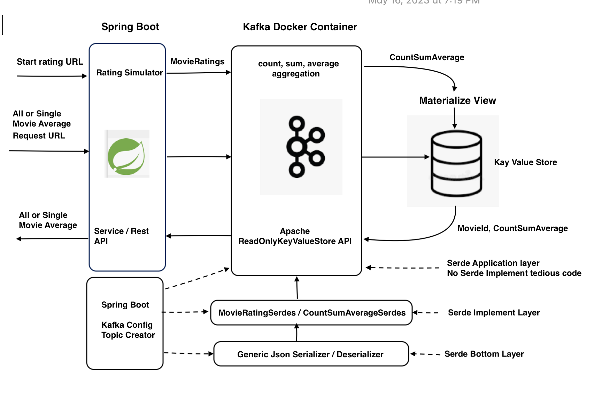

# spring-boot kafka json stateful average aggregation
## Key Points
1. Generic Json Serializer and Deserialize as bottom level, Customized Json Serdes of MovieRating and CountSumAverage objects as Implementation layer, be able to support complex objects in aggregation to fillful complex statistic work at one time.
2. Using Spring boot configure the Kafka Stream, Consumer and Producer, defaultKafkaStreamsConfig for "kstream" processor, Spring KafkaAdmin and TopicBuilder for creating topics saftely before the processor running. 
4. Within the parenthase {} of "(key, value, aggregate)->{}", complete all average calculations and related output transform.
5. Materialize view saves aggregation result to KeyValueStore. Each movieId has only one unique record!   
6. Spring Rest API calls service of ReadOnlyKeyValueStore<Long,CountAndSum> to show stateful records by id.
7. Java Math.random for similating movie rating events, List<KayPair<Long,CountSumAverage>> show all or single record in the store
8. Created Tumbling Time Window to verify our Generic JsonMapper and find properties setting related if time window works
9. Using Confluent 6.0 images run single broker for demo

## Work flow chart

## Data Modeling
 
### MovieRating 
   The model data for audiences rating movies, when creating KStream, consuming this objects, "time" field for potential time window
   
        @Data
        @NoArgsConstructor
        @AllArgsConstructor
        @Builder
        public class MovieRating {
            private Long movieId;
            private Double rating;
            private String movie;
            @JsonFormat(shape = JsonFormat.Shape.STRING,
                    pattern = "dd-MM-yyyy hh:mm:ss")
            public Date time;
        }

### CountSumAverage
   Aggregated object from movie rating object, which contains all results of aggregation topology, consider "value" of keyvalue pair
   when calling non arguments construtor explicitely initialize all members to simplify the initialize of aggregation
   
        @Data
        @ToString
        @AllArgsConstructor
        @Builder
        public class CountSumAverage {
            private Long movieId;
            private Long count;
            private Double sum;
            private Double average;
            private String movieName;
            public CountSumAverage() {
                this.count=0L;
                this.sum=0.0;
                this.average=0.0;
                this.movieId=0L;
                this.movieName="";
            }
        }

### Generic com.fasterxml.jackson.databind.ObjectMapper
   We created JsonMapper for simplify application layer and another important thing we have to explicitely set properties
    
   SerializationFeature.WRITE_DATES_AS_TIMESTAMPS as true 
    
   SerializationFeature.WRITE_DURATIONS_AS_TIMESTAMPS as true;
    
   which are decisively for time window work because time window need check consuming objects timestamp, if not setting or
   setting as false , the time window and  "suppress" refuse work !!!
     
        import com.fasterxml.jackson.databind.DeserializationFeature;
        import com.fasterxml.jackson.databind.ObjectMapper;
        import com.fasterxml.jackson.databind.SerializationFeature;

        public class JsonMapper {

          private static final ObjectMapper objectMapper = new ObjectMapper();

          static {
            objectMapper.configure(SerializationFeature.FAIL_ON_EMPTY_BEANS, false);
            objectMapper.configure(DeserializationFeature.FAIL_ON_UNKNOWN_PROPERTIES, false);
            objectMapper.configure(SerializationFeature.WRITE_DATES_AS_TIMESTAMPS, true);
            objectMapper.configure(SerializationFeature.WRITE_DURATIONS_AS_TIMESTAMPS, true);
            objectMapper.findAndRegisterModules();
          }

          /**
           * Map the given JSON String to the required class type.
           */
          public static <T> T readFromJson(String json, Class<T> clazz) throws MappingException {
            try {
              return objectMapper.readValue(json, clazz);
            } catch (Exception e) {
              throw new MappingException(e);
            }
          }

          /**
           * Map the given Object to a JSON String.
           */
          public static String writeToJson(Object obj) throws MappingException {
            try {
              return objectMapper.writeValueAsString(obj);
            } catch (Exception e) {
              throw new MappingException(e);
            }
          }

          public static String writeJsonToPretty (String json)    {
            try {
              return objectMapper.writerWithDefaultPrettyPrinter().writeValueAsString(json);
            } catch (Exception e) {
              throw new MappingException(e);
            }
          }
          public static String writeObjectToPrettyJson (Object obj)  {
            String json = writeToJson(obj);
            return writeJsonToPretty (json);

          }
        }

## Generic Json Serializer and Json Deserializer

### JsonSerializer
   implements org.apache.kafka.common.serialization.Serializer, which write java object to java String and serialize getBytes string 
   to java bytes (UTF_8) stream

     import org.apache.kafka.common.errors.SerializationException;
     import org.apache.kafka.common.serialization.Serializer;
     import java.nio.charset.StandardCharsets;
     import java.util.Map;
     public class JsonSerializer<T> implements Serializer<T> {
         public JsonSerializer() {
         }
         @Override
         public void configure(Map<String, ?> props, boolean isKey) {
         }
         // serialize Java Object to java Bytes String
         @Override
         public byte[] serialize(String topic, T data) {
             if (data == null)
                 return null;
             try {
                 //  JsonMapper.writeToJson(data) write java object to java String and then getBytes convert string to
                 //  java bytes (UTF_8) stream
                 return JsonMapper.writeToJson(data).getBytes(StandardCharsets.UTF_8);
             } catch (Exception e) {
                 throw new SerializationException("Error serializing JSON message", e);
             }
         }

         @Override
         public void close() {
         }
     }
   
### JsonDeserializer
   implement org.apache.kafka.common.serialization.Deserializer
   convert bytes to UTF_8 String and use then JsonMapper.readFromJson to read the String , finally deserialize to Java Object

      import org.apache.kafka.common.errors.SerializationException;
      import org.apache.kafka.common.serialization.Deserializer;

      import java.nio.charset.StandardCharsets;
      import java.util.Map;

      public class JsonDeserializer<T> implements Deserializer<T> {

          private Class<T> destinationClass;

          public JsonDeserializer(Class<T> destinationClass) {
              this.destinationClass = destinationClass;
          }

          @Override
          public void configure(Map<String, ?> props, boolean isKey) {
          }
          // Deserialize byte[] to an objects
          @Override
          public T deserialize(String topic, byte[] bytes) {
              if (bytes == null)
                  return null;
              try {
                  // convert bytes to UTF_8 String and then JsonMapper.readFromJson convert string to Java Object
                  return JsonMapper.readFromJson(new String(bytes, StandardCharsets.UTF_8), destinationClass);
              } catch (Exception e) {
                  throw new SerializationException("Error deserializing message", e);
              }
          }

          @Override
          public void close() {
          }
      }

## Json Serdes Implementation of Objects
  Generic Json Serializer and Json Deserializer create an Abstract layer to serialize / deserialize, Object Serdes provide type of those generic
  class to implement this Abstract layer, then create implementation layer, this json layer architecture to be able to simplify and standize the 
  Kstream processor (topology), which benefits team development.
  The Serdes Usage for typical objects in kstream processor will be like after implementing objects serdes:
  
  MovieRatingSerdes.serdes() ----- MovieRating Class serdes
  
  CountSumAverageSerdes.serdes()  ----- CountSumAverage serdes
  
### MovieRatingSerdes implementation

     import com.springboot.kafka.average.aggregation.model.MovieRating;
     import com.springboot.kafka.average.aggregation.serdes.JsonDeserializer;
     import com.springboot.kafka.average.aggregation.serdes.JsonSerializer;
     import org.apache.kafka.common.serialization.Serde;
     import org.apache.kafka.common.serialization.Serdes;

     public class MovieRatingSerdes extends Serdes.WrapperSerde<MovieRating> {
         public MovieRatingSerdes() {
             super (new JsonSerializer<>(),new JsonDeserializer<>(MovieRating.class));
         }
         public static Serde<MovieRating> serdes() {
             JsonSerializer<MovieRating> serializer = new JsonSerializer<>();
             JsonDeserializer<MovieRating> deSerializer = new JsonDeserializer<>(MovieRating.class);
             return Serdes.serdeFrom(serializer, deSerializer);
         }
     }

 
 ### CountAndSumSerdes implementation 
 
     import com.springboot.kafka.average.aggregation.model.CountSumAverage;
     import com.springboot.kafka.average.aggregation.serdes.JsonDeserializer;
     import com.springboot.kafka.average.aggregation.serdes.JsonSerializer;
     import org.apache.kafka.common.serialization.Serde;
     import org.apache.kafka.common.serialization.Serdes;

     public class CountAndSumSerdes extends Serdes.WrapperSerde<CountSumAverage> {
         public CountAndSumSerdes() {
             super (new JsonSerializer<>(),new JsonDeserializer<>(CountSumAverage.class));
         }
         public static Serde<CountSumAverage> serdes() {
             JsonSerializer<CountSumAverage> serializer = new JsonSerializer<>();
             JsonDeserializer<CountSumAverage> deSerializer = new JsonDeserializer<>(CountSumAverage.class);
             return Serdes.serdeFrom(serializer, deSerializer);
         }
     }
  
## Spring boot Kafka Topics, KStream, Producer and Consumer Configuration   
  We use Spring @Bean / @DependsOn annotatioh and KafkaAdmin / TopicBuilder to create kafka topics before all other @Bean start to run
  This operation gaurantees creates topics regardless of which kafka running environment is , OS , docker container or Kuberetes and second
  benefit avoid tedious manually create topics using kafka-topic command.
  
  Configuring the consumer, we use DefaultKafkaConsumerFactory, when we explicitely provide our JsonDeserializer by object type to ensure 
  deserialize json under our control, this is why we use the code configurator instead of using application.properties or application.yml because
  it seems to only suppert standard apache kafka Json Deserializer which is not object typed.
  
