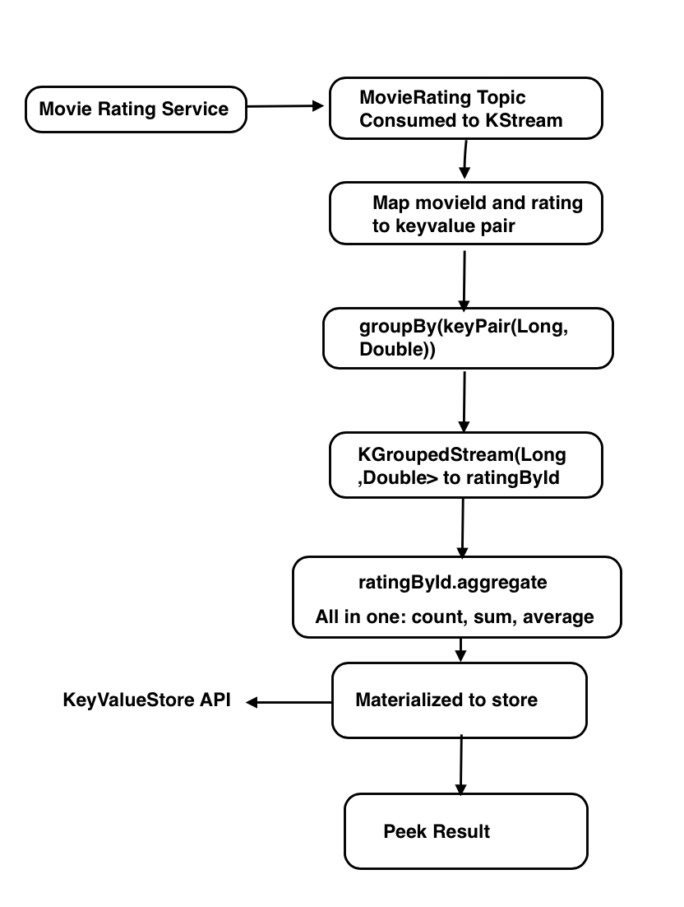
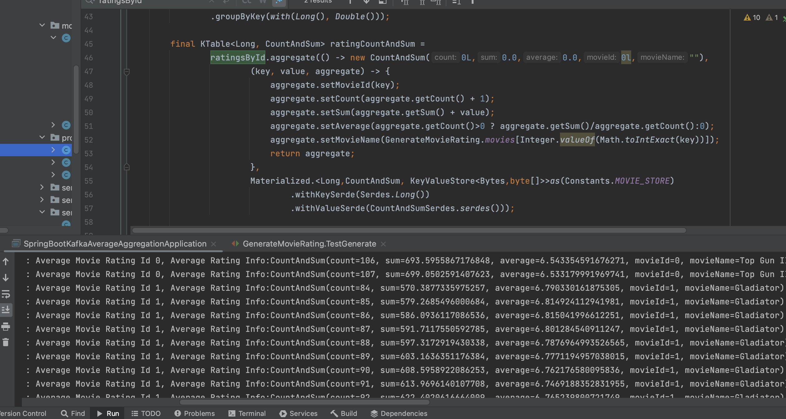
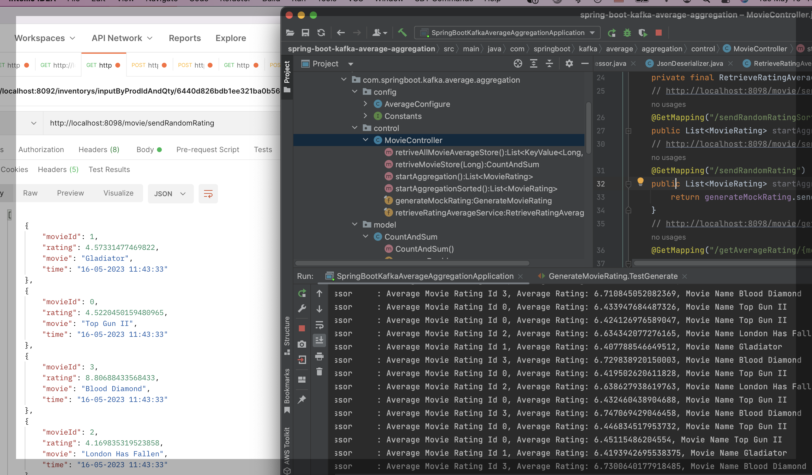
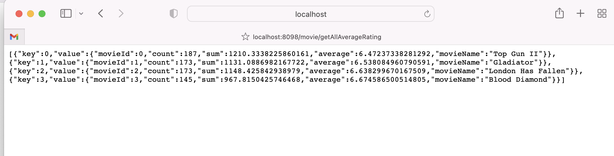

# spring-boot kafka json stateful average aggregation
## Key Points
1. Generic Json Serializer and Deserialize as bottom layer, Customized Json Serdes of MovieRating and CountSumAverage objects as Implementation layer, be able to support complex objects in aggregation to fillful complex statistic work at one time,standardize and simplify the ksteam processor
2. Using Spring boot configure the Kafka Stream, Consumer and Producer, defaultKafkaStreamsConfig for "kstream" processor, Spring KafkaAdmin and TopicBuilder for creating topics saftely before the processor running. 
4. Within the parenthase {} of "(key, value, aggregate)->{}", complete all average calculations and related output transform.
5. Materialize view saves aggregation result to KeyValueStore. Each movieId has only one unique record!   
6. Spring Rest API calls service of ReadOnlyKeyValueStore<Long,CountAndSum> to show stateful records by id.
7. Java Math.random for similating movie rating events, List<KayPair<Long,CountSumAverage>> show all or single record in the store
8. Created Tumbling Time Window to verify our Generic JsonMapper and find properties setting related if time window works
9. Using Confluent 6.0 images run single broker for demo

## My Kafka Related Links

  [spring-boot kafka json tumbling & hopping window aggregation for inventory/](https://johnzhang320.com/spring-boot-kafka-json-tumbling-and-hopping-window-aggregation-for-inventory/)
  
  [spring-boot kafka json stream/](https://johnzhang320.com/spring-boot-kafka-json-stream)
  
  [Spring boot connects to AWS EC2 Kafka docker container/](https://johnzhang320.com/kafka-aws-ec2-kafka-docker/)
  
  [Spring-boot kafka event driven/](https://johnzhang320.com/spring-boot-kafka-event-driven)
 
  [Spring-boot kafka stream sorted unique word count/](https://johnzhang320.com/sorted-unique-word-count/)
  
  

## Work flow chart

## Data Modeling
 
### MovieRating 
   The model data for audiences rating movies, when creating KStream, consuming this objects, "time" field for potential time window
   
        @Data
        @NoArgsConstructor
        @AllArgsConstructor
        @Builder
        public class MovieRating {
            private Long movieId;
            private Double rating;
            private String movie;
            @JsonFormat(shape = JsonFormat.Shape.STRING,
                    pattern = "dd-MM-yyyy hh:mm:ss")
            public Date time;
        }

### CountSumAverage
   Aggregated object from movie rating object, which contains all results of aggregation topology, consider "value" of keyvalue pair
   when calling non arguments construtor explicitely initialize all members to simplify the initialize of aggregation
   
        @Data
        @ToString
        @AllArgsConstructor
        @Builder
        public class CountSumAverage {
            private Long movieId;
            private Long count;
            private Double sum;
            private Double average;
            private String movieName;
            public CountSumAverage() {
                this.count=0L;
                this.sum=0.0;
                this.average=0.0;
                this.movieId=0L;
                this.movieName="";
            }
        }

### Generic com.fasterxml.jackson.databind.ObjectMapper
   We created JsonMapper for simplify application layer and another important thing we have to explicitely set properties
    
   SerializationFeature.WRITE_DATES_AS_TIMESTAMPS as true 
    
   SerializationFeature.WRITE_DURATIONS_AS_TIMESTAMPS as true;
    
   which are decisively for time window work because time window need check consuming objects timestamp, if not setting or
   setting as false , the time window and  "suppress" refuse work !!!
     
        import com.fasterxml.jackson.databind.DeserializationFeature;
        import com.fasterxml.jackson.databind.ObjectMapper;
        import com.fasterxml.jackson.databind.SerializationFeature;

        public class JsonMapper {

          private static final ObjectMapper objectMapper = new ObjectMapper();

          static {
            objectMapper.configure(SerializationFeature.FAIL_ON_EMPTY_BEANS, false);
            objectMapper.configure(DeserializationFeature.FAIL_ON_UNKNOWN_PROPERTIES, false);
            objectMapper.configure(SerializationFeature.WRITE_DATES_AS_TIMESTAMPS, true);
            objectMapper.configure(SerializationFeature.WRITE_DURATIONS_AS_TIMESTAMPS, true);
            objectMapper.findAndRegisterModules();
          }

          /**
           * Map the given JSON String to the required class type.
           */
          public static <T> T readFromJson(String json, Class<T> clazz) throws MappingException {
            try {
              return objectMapper.readValue(json, clazz);
            } catch (Exception e) {
              throw new MappingException(e);
            }
          }

          /**
           * Map the given Object to a JSON String.
           */
          public static String writeToJson(Object obj) throws MappingException {
            try {
              return objectMapper.writeValueAsString(obj);
            } catch (Exception e) {
              throw new MappingException(e);
            }
          }

          public static String writeJsonToPretty (String json)    {
            try {
              return objectMapper.writerWithDefaultPrettyPrinter().writeValueAsString(json);
            } catch (Exception e) {
              throw new MappingException(e);
            }
          }
          public static String writeObjectToPrettyJson (Object obj)  {
            String json = writeToJson(obj);
            return writeJsonToPretty (json);

          }
        }

## Generic Json Serializer and Json Deserializer

### JsonSerializer
   implements org.apache.kafka.common.serialization.Serializer, which write java object to java String and serialize getBytes string 
   to java bytes (UTF_8) stream

     import org.apache.kafka.common.errors.SerializationException;
     import org.apache.kafka.common.serialization.Serializer;
     import java.nio.charset.StandardCharsets;
     import java.util.Map;
     public class JsonSerializer<T> implements Serializer<T> {
         public JsonSerializer() {
         }
         @Override
         public void configure(Map<String, ?> props, boolean isKey) {
         }
         // serialize Java Object to java Bytes String
         @Override
         public byte[] serialize(String topic, T data) {
             if (data == null)
                 return null;
             try {
                 //  JsonMapper.writeToJson(data) write java object to java String and then getBytes convert string to
                 //  java bytes (UTF_8) stream
                 return JsonMapper.writeToJson(data).getBytes(StandardCharsets.UTF_8);
             } catch (Exception e) {
                 throw new SerializationException("Error serializing JSON message", e);
             }
         }

         @Override
         public void close() {
         }
     }
   
### JsonDeserializer
   implement org.apache.kafka.common.serialization.Deserializer
   convert bytes to UTF_8 String and use then JsonMapper.readFromJson to read the String , finally deserialize to Java Object

      import org.apache.kafka.common.errors.SerializationException;
      import org.apache.kafka.common.serialization.Deserializer;

      import java.nio.charset.StandardCharsets;
      import java.util.Map;

      public class JsonDeserializer<T> implements Deserializer<T> {

          private Class<T> destinationClass;

          public JsonDeserializer(Class<T> destinationClass) {
              this.destinationClass = destinationClass;
          }

          @Override
          public void configure(Map<String, ?> props, boolean isKey) {
          }
          // Deserialize byte[] to an objects
          @Override
          public T deserialize(String topic, byte[] bytes) {
              if (bytes == null)
                  return null;
              try {
                  // convert bytes to UTF_8 String and then JsonMapper.readFromJson convert string to Java Object
                  return JsonMapper.readFromJson(new String(bytes, StandardCharsets.UTF_8), destinationClass);
              } catch (Exception e) {
                  throw new SerializationException("Error deserializing message", e);
              }
          }

          @Override
          public void close() {
          }
      }

## Json Serdes Implementation of Objects
  Generic Json Serializer and Json Deserializer create an Abstract layer to serialize / deserialize, Object Serdes provide type of those generic
  class to implement this Abstract layer, then create implementation layer, this json layer architecture to be able to simplify and standize the 
  Kstream processor (topology), which benefits team development.
  The Serdes Usage for typical objects in kstream processor will be like after implementing objects serdes:
  
  MovieRatingSerdes.serdes() ----- MovieRating Class serdes
  
  CountSumAverageSerdes.serdes()  ----- CountSumAverage serdes
  
### MovieRatingSerdes implementation

     import com.springboot.kafka.average.aggregation.model.MovieRating;
     import com.springboot.kafka.average.aggregation.serdes.JsonDeserializer;
     import com.springboot.kafka.average.aggregation.serdes.JsonSerializer;
     import org.apache.kafka.common.serialization.Serde;
     import org.apache.kafka.common.serialization.Serdes;

     public class MovieRatingSerdes extends Serdes.WrapperSerde<MovieRating> {
         public MovieRatingSerdes() {
             super (new JsonSerializer<>(),new JsonDeserializer<>(MovieRating.class));
         }
         public static Serde<MovieRating> serdes() {
             JsonSerializer<MovieRating> serializer = new JsonSerializer<>();
             JsonDeserializer<MovieRating> deSerializer = new JsonDeserializer<>(MovieRating.class);
             return Serdes.serdeFrom(serializer, deSerializer);
         }
     }

 
 ### CountAndSumSerdes implementation 
 
     import com.springboot.kafka.average.aggregation.model.CountSumAverage;
     import com.springboot.kafka.average.aggregation.serdes.JsonDeserializer;
     import com.springboot.kafka.average.aggregation.serdes.JsonSerializer;
     import org.apache.kafka.common.serialization.Serde;
     import org.apache.kafka.common.serialization.Serdes;

     public class CountAndSumSerdes extends Serdes.WrapperSerde<CountSumAverage> {
         public CountAndSumSerdes() {
             super (new JsonSerializer<>(),new JsonDeserializer<>(CountSumAverage.class));
         }
         public static Serde<CountSumAverage> serdes() {
             JsonSerializer<CountSumAverage> serializer = new JsonSerializer<>();
             JsonDeserializer<CountSumAverage> deSerializer = new JsonDeserializer<>(CountSumAverage.class);
             return Serdes.serdeFrom(serializer, deSerializer);
         }
     }
  
## Spring boot Kafka Topics, KStream, Producer and Consumer Configuration   
  We use Spring @Bean / @DependsOn annotatioh and KafkaAdmin / TopicBuilder to create kafka topics before all other @Bean start to run
  This operation gaurantees creates topics regardless of which kafka running environment is , OS , docker container or Kuberetes and second
  benefit avoid tedious manually create topics using kafka-topic command.
  
  Configuring the consumer, we use DefaultKafkaConsumerFactory, when we explicitely provide our JsonDeserializer by object type to ensure 
  deserialize json under our control, this is why we use the code configurator instead of using application.properties or application.yml because
  it seems to only suppert standard apache kafka Json Deserializer which is not object typed.
  
  Use @EnableKafka and @EnableKafkaStream to make sure we can create proper KafkaTemplate for producer
  
     
     import com.springboot.kafka.average.aggregation.model.MovieRating;
     import org.apache.kafka.clients.admin.AdminClientConfig;
     import org.apache.kafka.clients.admin.NewTopic;
     import org.apache.kafka.clients.consumer.ConsumerConfig;
     import org.apache.kafka.clients.producer.ProducerConfig;
     import org.apache.kafka.common.serialization.LongDeserializer;
     import org.apache.kafka.common.serialization.LongSerializer;
     import org.apache.kafka.common.serialization.Serdes;
     import org.apache.kafka.streams.StreamsConfig;
     import org.apache.kafka.streams.processor.WallclockTimestampExtractor;
     import org.springframework.context.annotation.Bean;
     import org.springframework.context.annotation.Configuration;
     import org.springframework.context.annotation.DependsOn;
     import org.springframework.kafka.annotation.EnableKafka;
     import org.springframework.kafka.annotation.EnableKafkaStreams;
     import org.springframework.kafka.annotation.KafkaStreamsDefaultConfiguration;
     import org.springframework.kafka.config.ConcurrentKafkaListenerContainerFactory;
     import org.springframework.kafka.config.KafkaStreamsConfiguration;
     import org.springframework.kafka.config.TopicBuilder;
     import org.springframework.kafka.core.*;
     import org.springframework.kafka.support.serializer.JsonDeserializer;
     import org.springframework.kafka.support.serializer.JsonSerializer;

     import java.util.HashMap;
     import java.util.Map;

     @EnableKafkaStreams
     @EnableKafka
     @Configuration
     public class AverageAggregationConfigure {
         @Bean(name=Constants.BOOTSTRAP_ADMIN)
         public KafkaAdmin admin() {
             Map<String, Object> configs = new HashMap<>();
             configs.put(AdminClientConfig.BOOTSTRAP_SERVERS_CONFIG, Constants.BOOSTRAP_SERVER);
             return new KafkaAdmin(configs);
         }
         @Bean(name=Constants.INPUT_RATING_TOPIC)
         @DependsOn(Constants.BOOTSTRAP_ADMIN)
         public NewTopic newTopic1() {
             return TopicBuilder.name(Constants.INPUT_RATING_TOPIC)
                     .partitions(1)
                     .replicas(1)
                     .build();
         }

         @Bean(name=Constants.OUTPUT_RATING_AVERAGE_TOPIC)
         @DependsOn(Constants.INPUT_RATING_TOPIC)
         public NewTopic newTopic2() {
             return TopicBuilder.name(Constants.OUTPUT_RATING_AVERAGE_TOPIC)
                     .partitions(1)
                     .replicas(1)
                     .build();
         }
         @Bean(name= KafkaStreamsDefaultConfiguration.DEFAULT_STREAMS_CONFIG_BEAN_NAME)
         @DependsOn(Constants.OUTPUT_RATING_AVERAGE_TOPIC)
         public KafkaStreamsConfiguration kafkaStreamsConfiguration() {
             Map<String,Object> properties = new HashMap<>();
             properties.put(StreamsConfig.APPLICATION_ID_CONFIG, Constants.APPLICATION_ID_CONFIG);
             properties.put(StreamsConfig.BOOTSTRAP_SERVERS_CONFIG, Constants.BOOSTRAP_SERVER);
             properties.put(StreamsConfig.DEFAULT_KEY_SERDE_CLASS_CONFIG, Serdes.Long().getClass());
             properties.put(StreamsConfig.DEFAULT_VALUE_SERDE_CLASS_CONFIG, Serdes.Double().getClass());
             properties.put(ConsumerConfig.AUTO_OFFSET_RESET_CONFIG, "earliest");
             properties.put(StreamsConfig.CACHE_MAX_BYTES_BUFFERING_CONFIG, "0");
             properties.put(StreamsConfig.COMMIT_INTERVAL_MS_CONFIG, 10 * 1000);
             // For illustrative purposes we disable record caches.
             properties.put(StreamsConfig.CACHE_MAX_BYTES_BUFFERING_CONFIG, 0);
             properties.put(StreamsConfig.DEFAULT_TIMESTAMP_EXTRACTOR_CLASS_CONFIG, WallclockTimestampExtractor.class.getName());
             return new KafkaStreamsConfiguration(properties);
         }

         @Bean
         @DependsOn(Constants.OUTPUT_RATING_AVERAGE_TOPIC)
         public ProducerFactory<Long, MovieRating> producerFactory() {
             final Map<String ,Object> config = new HashMap<>();
             config.put(ProducerConfig.BOOTSTRAP_SERVERS_CONFIG, Constants.BOOSTRAP_SERVER);
             config.put(ProducerConfig.KEY_SERIALIZER_CLASS_CONFIG, LongSerializer.class);
             config.put(ProducerConfig.VALUE_SERIALIZER_CLASS_CONFIG, JsonSerializer.class);
             return new DefaultKafkaProducerFactory<Long, MovieRating>(config);
         }
         @Bean
         @DependsOn(Constants.OUTPUT_RATING_AVERAGE_TOPIC)
         public KafkaTemplate<Long,MovieRating> kafkaTemplate(final ProducerFactory producerFactory) {
             return new KafkaTemplate<>(producerFactory());
         }
         @Bean
         @DependsOn("consumerFactoryId")
         public ConcurrentKafkaListenerContainerFactory<Long, MovieRating> kafkaListenerContainerFactoryMovieRating (final 
                                                                   ConsumerFactory<Long,MovieRating> consumerFactory) {
             final ConcurrentKafkaListenerContainerFactory<Long,MovieRating> factory = new ConcurrentKafkaListenerContainerFactory();
             factory.setConsumerFactory(consumerFactoryMovieRating());
             return factory;
         }

         @Bean(name="consumerFactoryId")
         @DependsOn(Constants.OUTPUT_RATING_AVERAGE_TOPIC)
         public ConsumerFactory<Long, MovieRating> consumerFactoryMovieRating() {
             final Map<String ,Object> config = new HashMap<>();
             config.put(ConsumerConfig.BOOTSTRAP_SERVERS_CONFIG, Constants.BOOSTRAP_SERVER);
             config.put(ConsumerConfig.GROUP_ID_CONFIG, Constants.CONSUMER_GROUP_ID);
             config.put(ConsumerConfig.KEY_DESERIALIZER_CLASS_CONFIG, LongDeserializer.class);
             config.put(ConsumerConfig.VALUE_DESERIALIZER_CLASS_CONFIG, JsonDeserializer.class);
             // trust model package, critical step
             config.put(JsonDeserializer.TRUSTED_PACKAGES,"com.com.springboot.kafka.average.aggregation.model.MovieRating");
             return new DefaultKafkaConsumerFactory<Long,MovieRating>(config, new LongDeserializer(),
                     new com.springboot.kafka.average.aggregation.serdes.JsonDeserializer<MovieRating>(MovieRating.class));
         }
     }
 
 ## KStream Processor
   In confluent community, this is similar to Topology code, difference this is loaded as default singleton instance by Spring @Bean and 
   @EnableKafkaStream annotations. Because We configure KafkaStreamsDefaultConfiguration.DEFAULT_STREAMS_CONFIG_BEAN_NAME, so we should
   follow using "kstream" as processor name
   
   We created two processor , first one has no time window, second one has tumbling time window , we put time window to another article , here
   introduce no time window one. but this repository already provide time window code.
   
   Let's see the topologic flow chart for average aggregation:
   
  
   
   
      import com.springboot.kafka.average.aggregation.config.Constants;
      import com.springboot.kafka.average.aggregation.model.CountSumAverage;
      import com.springboot.kafka.average.aggregation.model.MovieRating;
      import com.springboot.kafka.average.aggregation.serdeImpl.CountSumAverageSerdes;
      import com.springboot.kafka.average.aggregation.serdeImpl.MovieRatingSerdes;
      import com.springboot.kafka.average.aggregation.service.GenerateMovieRating;
      import lombok.extern.slf4j.Slf4j;
      import org.apache.kafka.common.utils.Bytes;
      import org.apache.kafka.streams.KeyValue;
      import org.apache.kafka.streams.StreamsBuilder;
      import org.apache.kafka.streams.kstream.*;
      import org.apache.kafka.streams.state.KeyValueStore;
      import org.springframework.context.annotation.Bean;
      import org.springframework.context.annotation.Configuration;
      import org.springframework.kafka.annotation.EnableKafka;
      import org.springframework.kafka.annotation.EnableKafkaStreams;
      import static org.apache.kafka.streams.kstream.Grouped.with;
      import static org.apache.kafka.common.serialization.Serdes.Double;
      import static org.apache.kafka.common.serialization.Serdes.Long;
      @Configuration
      @EnableKafka
      @EnableKafkaStreams
      @Slf4j
      public class AverageProcessor {

          @Bean
          public KStream<Long, CountSumAverage> kStream(StreamsBuilder streamsBuilder) {
              KStream<Long, MovieRating> moveRatingStream = streamsBuilder.stream(Constants.INPUT_RATING_TOPIC,
                      Consumed.with(Long(), MovieRatingSerdes.serdes())
                              .withTimestampExtractor(new MovieTimeExtractor()));

              KGroupedStream<Long, Double> ratingsById = moveRatingStream
                      .map((key, rating) -> new KeyValue<>(rating.getMovieId(), rating.getRating()))
                      .groupByKey(with(Long(), Double()));

              final KTable<Long, CountSumAverage> ratingCountAndSum =
                      ratingsById.aggregate(() -> new CountSumAverage(),  // initial when create instance
                              (key, value, aggregate) -> {
                                  aggregate.setMovieId(key);
                                  aggregate.setCount(aggregate.getCount() + 1);
                                  aggregate.setSum(aggregate.getSum() + value);
                                  aggregate.setAverage(aggregate.getCount()>0 ? aggregate.getSum()/aggregate.getCount():0);
                                  aggregate.setMovieName(GenerateMovieRating.movies[Integer.valueOf(Math.toIntExact(key))]);
                                  return aggregate;
                              },
                              Materialized.<Long, CountSumAverage, KeyValueStore<Bytes,byte[]>>as(Constants.MOVIE_STORE)
                                      .withKeySerde(Long())
                                      .withValueSerde(CountSumAverageSerdes.serdes()));

              KStream<Long, CountSumAverage> retResult=ratingCountAndSum.toStream()
                      .peek((key,value)->log.info("Average Movie Rating Id {}, Average Rating: {}, Movie Name {}",
                              key,value.getAverage(),value.getMovieName()));

              return retResult;

          }
      }
   
## Create Test code to simulate movie rating events 
   Use KafkaTemplate send movie rating
   Using Math.random to dynamically create rating number and rating for dynamic movies
   In order test the time window suppress, sorted or not sorted movie

      @Service
      @RequiredArgsConstructor
      public class GenerateMovieRating {
          private  final KafkaTemplate<Long, MovieRating> kafkaTemplate;
          public static String movies[]={"Top Gun II","Gladiator","London Has Fallen","Blood Diamond","Troy"};
          public  List<MovieRating> createRandomMovieRation() {
              List<MovieRating> list = new ArrayList<>();
              for (Long i=0L; i<100L; i++) {
                  Double r;
                  r = 3+Math.random() * 7.0;
                  int l = (int) (Math.random() * 4.0);
                  Long id = Long.valueOf(l);
                  MovieRating movieRating = new MovieRating(id,r,movies[l],new Date());
                  list.add(movieRating);
              }
              return list;
          }

          public List<MovieRating> sendByRandomDurationSorted () {
              List<MovieRating> list =createRandomMovieRation();
              list.sort((o1,o2)->o1.getMovieId().compareTo(o2.getMovieId()));
              list.forEach(movieRating->{
                  int l = (int) (Math.random() * 1000.0);  // millis seconds
                  try {
                      Thread.sleep(l);
                  } catch (InterruptedException s) {}
                  kafkaTemplate.send(Constants.INPUT_RATING_TOPIC,movieRating.getMovieId(),movieRating);
              });
              return list;
          }

          public List<MovieRating> sendByRandomDuration () {
              List<MovieRating> list =createRandomMovieRation();

              list.forEach(movieRating->{
                  int l = (int) (Math.random() * 1000.0);  // millis seconds
                  try {
                      Thread.sleep(l);
                  } catch (InterruptedException s) {}
                  kafkaTemplate.send(Constants.INPUT_RATING_TOPIC,movieRating.getMovieId(),movieRating);
              });
              return list;
          }
      }
 
 ## Create ReadOnlyKeyValueStore service and iterator all of them to array list, Restful API call it
 
      import com.springboot.kafka.average.aggregation.config.Constants;
      import com.springboot.kafka.average.aggregation.model.CountSumAverage;
      import org.apache.kafka.streams.KafkaStreams;
      import org.apache.kafka.streams.KeyValue;
      import org.apache.kafka.streams.StoreQueryParameters;
      import org.apache.kafka.streams.state.KeyValueIterator;
      import org.apache.kafka.streams.state.QueryableStoreTypes;
      import org.apache.kafka.streams.state.ReadOnlyKeyValueStore;
      import org.springframework.beans.factory.annotation.Autowired;
      import org.springframework.kafka.annotation.EnableKafka;
      import org.springframework.kafka.annotation.EnableKafkaStreams;
      import org.springframework.kafka.config.StreamsBuilderFactoryBean;
      import org.springframework.stereotype.Service;

      import java.util.ArrayList;
      import java.util.List;

      @Service
      @EnableKafka
      @EnableKafkaStreams
      public class RetrieveRatingAverageService {

          private StreamsBuilderFactoryBean streamsBuilderFactoryBean;
          @Autowired
          public RetrieveRatingAverageService(StreamsBuilderFactoryBean streamsBuilderFactoryBean) {
              this.streamsBuilderFactoryBean = streamsBuilderFactoryBean;
          }
          public CountSumAverage getStoreCountAndSum(Long movieId) {
              return initializeStore().get(movieId);
          }
          public List<KeyValue<Long, CountSumAverage>> getAllKeyValueStores() {
              List<KeyValue<Long, CountSumAverage>> list = new ArrayList<>();
              ReadOnlyKeyValueStore <Long, CountSumAverage> keyValueStores = this.initializeStore();
              KeyValueIterator<Long, CountSumAverage> keyValueIterator = keyValueStores.all();
              while (keyValueIterator.hasNext()) {
                  list.add(keyValueIterator.next());
              }
              return list;
          }
          private ReadOnlyKeyValueStore<Long, CountSumAverage> initializeStore() {
              KafkaStreams kafkaStreams = streamsBuilderFactoryBean.getKafkaStreams();
              return kafkaStreams.store(
                      StoreQueryParameters.fromNameAndType(
                              Constants.MOVIE_STORE,
                              QueryableStoreTypes.keyValueStore()
                      )
              );
          }
      }
      
 ## Test Result
 
 ### Sorted Progress Result
 
   
     
 ### Not Sorted Progress Result
 
   
     
 ## Final Result from stateful keyvalue store 
 
 ### Uniquely save data to keyvalue store by Id without intermediate data
   This is amazing, Materialize View save the data by Key, which suppress all intermediate data, get data uniquely by id
   Here we simulated four movies, then keyvalue store only save four records, super suppressed (to unique by id)
     
   
     
### Update store data in store dynamically
   Materialize View is saving new aggregated data to store dynamically, real time update, I delibrately reload  
   http://localhost:8098/movie/getAllAverageRating link while stream is in progress processing, the data in store 
   immediately change!
  
   
   
# Conclusion
  Our Json Serializer and Json Deserializer to be easily implement topology by all in one aggregation. stateful Aggregation
  make sense to accumulate our statistic result and can be dynamically updated by materialize view, which is super suppressed data(unique by key)
  
   
